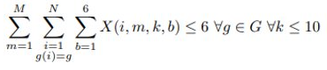

### CPScheduling 1:
The CPScheduling 1 is the model I've talked in my presentation on the class.

There are 5 fundamental constraints in this model:

1. Two class have the same teacher need to schedule separately:

2. If a class studies in 1 room, number of students less or equal to the  room capacity:

3. All of the classes can not be assigned in 2 separated sessions:

4. The total periods assigned for the given class should be exactly equal to the number of periods it:

=> This constraint ensures that a class is either assigned exactly the required number of periods in a specific block or not assigned at all in that block( If different from t(i), that specific session cannot hold all the t(i) periods of class i).

5. One room contains only one class at each period:

*Note: This model only prints solution when all classes from the input can be scheduled so I don't print the number of scheduled class in my code.

### CPScheduling 2:
This model is a simpler and less strict model than the following CPScheduling 1 I've talked. It aims to optimize the total number of scheduled class so you can see I print out the number of scheduled class in my code. There are 4 constraints in this model:

1. Two classes have the same teacher need to schedule seperately.
2. If a class studies in 1 room, number of students less or equal to the  room capacity.
3. One room contains only one class at each period.
4. Class can not be assigned in 2 separated sessions

Anyway, it's depend on the input and your purpose that you can choose to schedule your own timetable with CPScheduling 1 or 2.

### Data Generation:
Using data_gen.py file to generate a random input from the number of class N and the capacity of each room M you selected.
